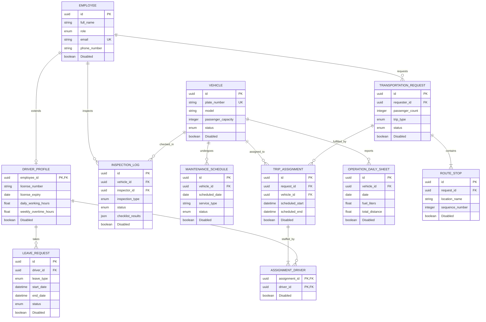

# Land Transport Coordination System (LTCS) - Data Model

This document defines the entities, attributes, and relationships for the LTCS, designed for scalability, data integrity, and compliance with transportation safety rules.

## Entity Relationship Diagram (ERD)

---

## 1. Identity & Personnel Module
Tracks all users and their specialized roles, particularly drivers.

### Entity: `Employee`
Base entity for all system users.
- `id` (UUID, PK): Unique identifier.
- `full_name` (String): Full name of the employee.
- `role` (Enum): `MANAGER`, `COORDINATOR`, `STAFF`, `FLEET_ADMIN`, `DRIVER`.
- `email` (String, Unique): Work email address.
- `phone_number` (String): Contact number.
- `department_id` (UUID, FK): Link to department (optional).
- `Disabled` (Boolean): Soft-delete flag.

### Entity: `DriverProfile`
Extension of the Employee entity for driver-specific metrics.
- `employee_id` (UUID, FK, PK): Link to `Employee`.
- `license_number` (String): Driver's license ID.
- `license_expiry` (Date): Expiration date of the license.
- `total_annual_leave` (Integer): Total allowed leave days per year.
- `used_leave_hours` (Float): Total leave hours taken.
- `daily_working_hours` (Float): Tracking hours for the current day (Max 10).
- `weekly_overtime_hours` (Float): Tracking overtime for the current week (Max 5).
- `current_status` (Enum): `AVAILABLE`, `ON_TRIP`, `ON_LEAVE`, `OFF_DUTY`.
- `Disabled` (Boolean): Soft-delete flag.

---

## 2. Assets (Fleet) Module
Manages the vehicles and their maintenance schedules.

### Entity: `Vehicle`
- `id` (UUID, PK): Unique identifier.
- `plate_number` (String, Unique): Vehicle registration number.
- `model` (String): Car model and year.
- `color` (String): Exterior color.
- `passenger_capacity` (Integer): Number of passengers it can carry.
- `avg_fuel_consumption` (Float): L/100km or similar metric.
- `current_mileage` (Float): Total distance traveled.
- `status` (Enum): `AVAILABLE`, `ASSIGNED`, `IN_USE`, `MAINTENANCE`, `UNDER_INSPECTION`.
- `Disabled` (Boolean): Soft-delete flag.

### Entity: `MaintenanceSchedule`
Simplified scheduling for vehicle servicing.
- `id` (UUID, PK): Unique identifier.
- `vehicle_id` (UUID, FK): Link to `Vehicle`.
- `scheduled_date` (Date): Planned date for servicing.
- `service_type` (String): e.g., "Oil Change", "Brake Check".
- `status` (Enum): `SCHEDULED`, `IN_PROGRESS`, `COMPLETED`, `CANCELLED`.
- `Disabled` (Boolean): Soft-delete flag.

---

## 3. Transportation Requests Module
Handles the lifecycle of a user's trip request.

### Entity: `TransportationRequest`
- `id` (UUID, PK): Unique identifier.
- `requester_id` (UUID, FK): Employee who made the request.
- `passenger_count` (Integer): Number of people traveling.
- `trip_type` (Enum): `SHORT_TRIP`, `LONG_TRIP`.
- `request_date` (DateTime): When the request was submitted.
- `preferred_start_time` (DateTime): Desired departure.
- `status` (Enum): `DRAFT`, `PENDING`, `APPROVED`, `REJECTED`, `CANCELLED`, `COMPLETED`.
- `description` (Text): Purpose or additional notes.
- `Disabled` (Boolean): Soft-delete flag.

### Entity: `RouteStop`
Individual legs of a trip.
- `id` (UUID, PK): Unique identifier.
- `request_id` (UUID, FK): Link to `TransportationRequest`.
- `location_name` (String): Name of the destination/stop.
- `sequence_number` (Integer): Order of the stop.
- `latitude` (Float): Geographic coordinate.
- `longitude` (Float): Geographic coordinate.
- `estimated_arrival_time` (DateTime): Target arrival time.
- `Disabled` (Boolean): Soft-delete flag.

---

## 4. Operations & Safety Module
Bridges requests to physical resources and ensures safety compliance.

### Entity: `TripAssignment`
Links a request to a specific vehicle.
- `id` (UUID, PK): Unique identifier.
- `request_id` (UUID, FK): Link to `TransportationRequest`.
- `vehicle_id` (UUID, FK): Link to `Vehicle`.
- `scheduled_start` (DateTime): Assigned departure time.
- `scheduled_end` (DateTime): Assigned return time.
- `status` (Enum): `ASSIGNED`, `IN_PROGRESS`, `COMPLETED`.
- `Disabled` (Boolean): Soft-delete flag.

### Entity: `AssignmentDriver` (Join Table)
Handles the "Two drivers for long trips" rule.
- `assignment_id` (UUID, FK): Link to `TripAssignment`.
- `driver_id` (UUID, FK): Link to `DriverProfile`.
- `Disabled` (Boolean): Soft-delete flag.

### Entity: `InspectionLog`
Results of vehicle checks.
- `id` (UUID, PK): Unique identifier.
- `vehicle_id` (UUID, FK): Link to `Vehicle`.
- `inspector_id` (UUID, FK): Link to `Employee` (Fleet Admin or Driver).
- `inspection_type` (Enum): `PRE_TRIP`, `POST_TRIP`, `DAILY`, `WEEKLY`, `MONTHLY`, `URGENT`.
- `inspection_date` (DateTime): When the check occurred.
- `status` (Enum): `PASSED`, `FAILED`.
- `checklist_results` (JSON): Dynamic results of check items.
- `mileage_at_inspection` (Float): Recorded mileage.
- `Disabled` (Boolean): Soft-delete flag.

### Entity: `OperationDailySheet`
Daily reporting for fuel and distance.
- `id` (UUID, PK): Unique identifier.
- `vehicle_id` (UUID, FK): Link to `Vehicle`.
- `date` (Date): Day of operation.
- `fuel_liters` (Float): Amount of fuel added.
- `refill_time` (Time): Time of refill.
- `start_mileage` (Float): Mileage at start of day.
- `end_mileage` (Float): Mileage at end of day.
- `total_distance` (Float): Calculated (End - Start).
- `Disabled` (Boolean): Soft-delete flag.

---

## 5. Leave Management Module
Tracks driver availability.

### Entity: `LeaveRequest`
- `id` (UUID, PK): Unique identifier.
- `driver_id` (UUID, FK): Link to `DriverProfile`.
- `leave_type` (Enum): `ANNUAL`, `SICK`, `EMERGENCY`.
- `start_date` (DateTime): Start of leave.
- `end_date` (DateTime): End of leave.
- `status` (Enum): `DRAFT`, `PENDING`, `APPROVED`, `REJECTED`.
- `Disabled` (Boolean): Soft-delete flag.

---

## Senior Engineer Rationale & Design Notes

1.  **Soft-Delete with `Disabled`**: Using a `Disabled` boolean allows us to keep historical records for audit trails (e.g., Journey Logs) while filtering them out of active coordination views. 
    - *Tip*: Use **Partial Unique Indexes** (e.g., `WHERE Disabled = false`) for fields like `email` or `plate_number` to allow re-using identifiers if the previous record was "deleted".
2.  **Audit Integrity**: The `OperationDailySheet` and `InspectionLog` are never truly deleted, only `Disabled`. This ensures that even if a vehicle is retired, its historical fuel and safety data remain available for annual audits.
3.  **The 2-Driver Rule**: `AssignmentDriver` acts as a flexible join table. For long trips, two records are created here linked to one `TripAssignment`.
4.  **Flexible Checklists**: JSON storage in `InspectionLog` ensures that as new safety regulations emerge, we can update the "Checklist" without modifying the database schema.
